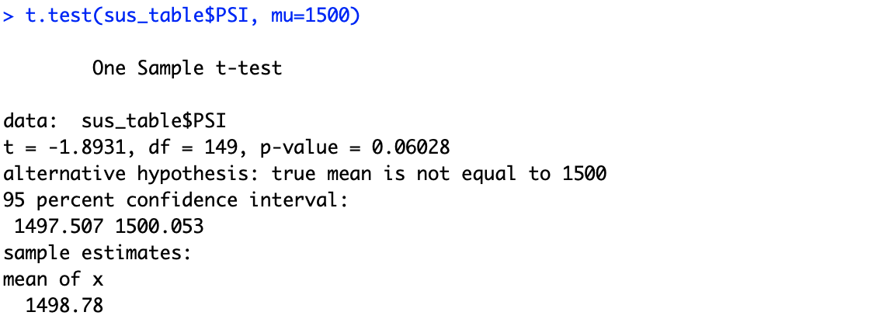
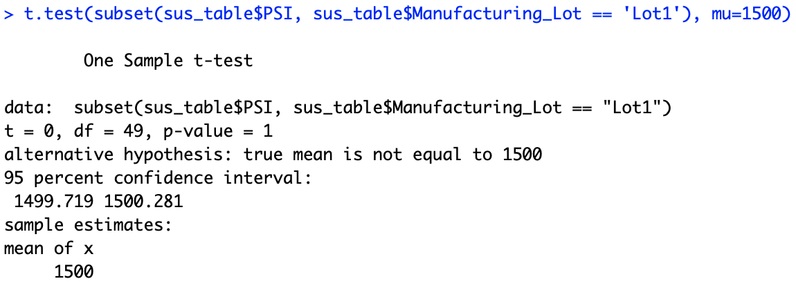
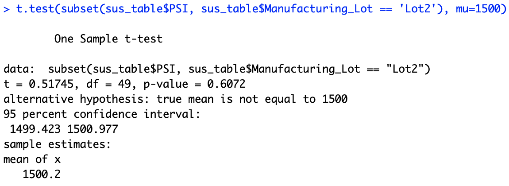
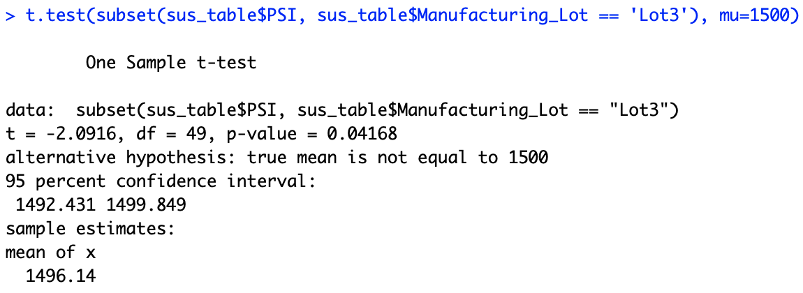

# MechaCar Statistical Analysis

## Linear Regression to Predict MPG

The variables that provided a non-random amount of variance to MPG values include the intercept, the vehicle length, and the ground clearance. Because of this, the slope of the linear model cannot be considered to be zero because these are non-zero variables in the linear regression model. 

Because the intercept has a significant amount of variability, we may need to fine tune our model either by scaling existing variables or adding new variables. As it is right now, the model does not seem to predict MPG very well.

## Summary Statistics on Suspension Coils

Unfortunately, not all manufacturing lots meet the design specifications. Though the total variance and Lot 1/2 variances are under 100 PSI, Lot 3 coils exceed this number with 170.3 PSI in variance. 

## T-Tests on Suspension Coils

Based on our t-tests, we find that we fail to reject the null hypothesis that the PSI is the same as the population mean of 1500 PSI for the overall sample and Lots 1 and 2 as seen by the images below:

However, when looking at the t-test for Lot 3 data, the p-value is 0.04168, which is lower than the 0.05 value we look for. Therefore, we reject the null hypothesis that the average PSI is the same as the population mean of 1500 PSI.

## Study Design: MechaCar vs Competition

One study that can be done to quantify the MechaCar's performance against the competition is to measure some metrics such as fuel efficiency, maintenance cost, or safety rating. For instance, one metric can be MPG (miles per gallon), and we can test this by creating a statistical study that compares the MechaCar's MPG to the average MPG of any other car in the market.

In this case, the null hypothesis would be that the MechaCar's MPG is less than or equal to the average car's MPG, while the alternate hypothesis is that the MechaCar's MPG is greater than the average car's MPG. To test this, we would need to get the average and variance of the average car MPG and run a Z-test on the MechaCar's MPG to see what the resulting p-value would be. From there, we can determine whether or not the null hypothesis can be rejected.